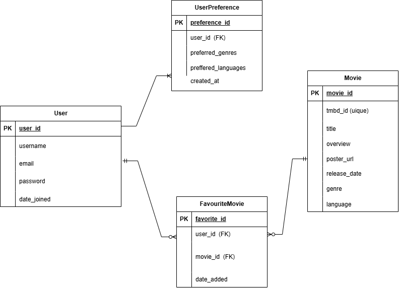

# 🎬 Movie Backend API

A powerful Django REST Framework API for movie discovery, user management, and personalized recommendations. Features TMDB integration, JWT authentication, Redis caching,PostgreSQL database , and swagger documentation .

## ✨ Features

- **Movie Discovery** - Trending movies, search functionality, detailed movie information, and personalized recommendations
- **JWT Authentication** - Secure user registration and login with token-based authentication
- **Favorites System** - Save and manage favorite movies with full CRUD operations
- **Personalized Preferences** - User-specific genre and language preferences for tailored recommendations
- **Redis Caching** - High-performance caching for improved response times and session management
- **Swagger Documentation** - Interactive API documentation with automatic endpoint discovery
- **PostgreSQL** - Robust relational database for data persistence
- **TMDB Integration** - Real-time movie data from The Movie Database API

## 🛠️ Tech Stack

- **Backend Framework**: Django 5.2.8 + Django REST Framework
- **Database**: PostgreSQL
- **Cache**: Redis
- **Authentication**: JWT (Simple JWT)
- **API Documentation**: Swagger/OpenAPI (drf-yasg)
- **External API**: The Movie Database (TMDB)
- **CORS**: django-cors-headers

## 🚀 Quick Start

### Prerequisites
- Python 3.8+
- PostgreSQL
- Redis
- TMDB API account ([Get API Key](https://www.themoviedb.org/settings/api))

### Installation & Setup

1. **Clone the repository**
   ```bash
   git clone <repository-url>
   cd alx-project-nexus
   ```

2. **Create virtual environment**
   ```bash
   python -m venv venv
   source venv/bin/activate  # On Windows: venv\Scripts\activate
   ```

3. **Install dependancies**
   ```bash
   pip install -r requirements.txt
   ```

4.  **Environment configuration**
Create a .env file in the project root:

```
SECRET_KEY=your-django-secret-key-here
DEBUG=True
DJANGO_ALLOWED_HOSTS=localhost,127.0.0.1
DATABASE_NAME=moviedb
DATABASE_USER=postgres
DATABASE_PASSWORD=your-postgres-password
DATABASE_HOST=localhost
DATABASE_PORT=5432
TMDB_API_KEY=your-tmdb-api-key-here
REDIS_URL=redis://localhost:6379/1
SIMPLE_JWT_SECRET_KEY=your-jwt-secret-key-here
```

5. **Database setup**
   ```bash
   python manage.py migrate
   python manage.py createsuperuser
   ```

6.  **Run development**
   ```bash
   python manage.py runserver
   ```


##  ERD DIAGRAM REPRESENTATION FOR THE BACKEND MOVIE RECOMMENDATION APP




### Relationships


1. User → FavouriteMovie (1:N)
   
Each user can have many favourite movies

Each favourite movie record belongs to one user


2. User → UserPreference (1:N)

A user can have multiple preferences

Each preference is linked to one user


3. FavouriteMovie → Movie (N:1)
   
Each favourite movie record points to one movie

A movie can be the favourite for many users


